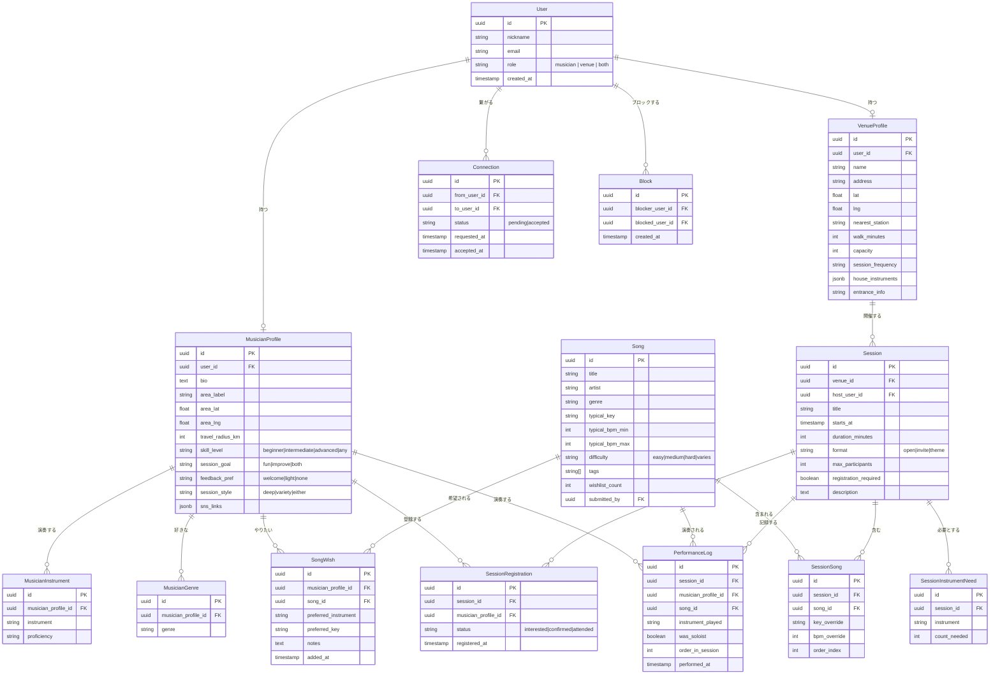

# NearJam — 技術設計書

**バージョン**: 0.1（2026-02-26）
**ステータス**: ドラフト

---

## 1. アーキテクチャ概要

```
┌─────────────────────────────────────────────────────────────┐
│                    ブラウザ / PWA                            │
│               Next.js（App Router, SSR）                     │
└───────────────────────────┬─────────────────────────────────┘
                            │ HTTPS
┌───────────────────────────▼─────────────────────────────────┐
│          Azure Static Web Apps（無料プラン）                  │
│       Next.js フロントエンド + API Routes（Edge/Node）         │
└──────┬────────────────────┬────────────────────────────────-┘
       │                    │
       │ 認証（NextAuth.js） │ DB クエリ（Prisma ORM）
       │                    │
┌──────▼──────┐   ┌─────────▼───────────────────────────────┐
│  NextAuth   │   │  Azure Database for PostgreSQL            │
│  (JWT/DB    │   │  Flexible Server — Burstable B1ms         │
│   セッション) │   │  （標準 PostgreSQL — どこでも移行可能）     │
└─────────────┘   └─────────────────────────────────────────-┘
                            │
                  ┌─────────▼──────────┐
                  │   Claude API       │
                  │  （AI 提案機能）    │
                  └────────────────────┘
```

### 設計原則

1. **可搬性最優先** — アプリケーション層に Azure 固有のサービスを使わない。PostgreSQL・Next.js・NextAuth.js はどこでも動く。移行先の候補: Vercel + Railway / Supabase。
2. **スケールゼロ** — Azure Static Web Apps + API Routes はアイドル時のコストがかからない。
3. **標準 PostgreSQL** — Cosmos DB・Azure SQL 固有機能・独自拡張は使わない。Prisma ORM 経由で標準 SQL のみ使用。

---

## 2. 技術スタック

| レイヤー | 技術 | 選定理由 |
|---------|------|---------|
| フロントエンド | Next.js 15（App Router）+ TypeScript | SSR/SSG・API Routes・可搬性 |
| スタイリング | Tailwind CSS | ユーティリティファースト・実行時オーバーヘッドなし |
| ORM | Prisma | 型安全な DB アクセス・マイグレーション管理・DB 非依存 |
| 認証 | NextAuth.js v5 | Google OAuth + メールマジックリンク対応・ベンダーロックインなし |
| データベース | PostgreSQL 16 | 標準 SQL・Azure DB for PostgreSQL Flexible でホスティング |
| AI | Anthropic Claude API | セッション組み合わせ提案・ダイジェスト生成 |
| ホスティング | Azure Static Web Apps | フロントエンド無料・API Routes は Azure Functions ランタイム |
| CI/CD | GitHub Actions | `main` ブランチへのプッシュで自動デプロイ |
| ローカル開発 | Docker Compose | PostgreSQL + アプリをコンテナで統合 |

---

## 3. データベーススキーマ

### ER図



---

## 4. 主要 API エンドポイント

すべてのルートは `/api/` 配下の Next.js API Routes として実装します。

### 認証
| メソッド | パス | 説明 |
|--------|------|------|
| POST | `/api/auth/[...nextauth]` | NextAuth.js ハンドラ |

### ミュージシャン
| メソッド | パス | 説明 |
|--------|------|------|
| GET | `/api/musicians/me` | 自分のミュージシャンプロフィール取得 |
| PUT | `/api/musicians/me` | 自分のミュージシャンプロフィール更新 |
| GET | `/api/musicians/[id]` | 公開ミュージシャンプロフィール取得 |
| GET | `/api/musicians/me/wishlist` | 自分のウィッシュリスト取得 |
| POST | `/api/musicians/me/wishlist` | ウィッシュリストに曲を追加 |
| DELETE | `/api/musicians/me/wishlist/[songId]` | ウィッシュリストから曲を削除 |

### 会場
| メソッド | パス | 説明 |
|--------|------|------|
| GET | `/api/venues/[id]` | 会場プロフィール取得 |
| PUT | `/api/venues/me` | 自分の会場プロフィール更新 |
| GET | `/api/venues/me/sessions` | 自分の会場のセッション一覧 |

### セッション
| メソッド | パス | 説明 |
|--------|------|------|
| GET | `/api/sessions` | セッション一覧（エリア・ジャンル・楽器・曲でフィルタ） |
| POST | `/api/sessions` | セッション作成（会場・ホストのみ） |
| GET | `/api/sessions/[id]` | セッション詳細取得 |
| PUT | `/api/sessions/[id]` | セッション更新 |
| POST | `/api/sessions/[id]/register` | 参加意思表明・参加登録 |
| GET | `/api/sessions/[id]/attendees` | 参加者一覧取得（登録者のみ） |
| GET | `/api/sessions/[id]/log` | 演奏ログ取得 |
| POST | `/api/sessions/[id]/log` | 演奏ログ追加（ホストのみ） |

### 曲
| メソッド | パス | 説明 |
|--------|------|------|
| GET | `/api/songs` | 曲検索（タイトル・アーティスト・ジャンル・タグ） |
| POST | `/api/songs` | 曲の新規投稿（審査後に公開） |
| GET | `/api/songs/[id]` | 曲詳細取得 |

### マッチング
| メソッド | パス | 説明 |
|--------|------|------|
| GET | `/api/matching/sessions` | ウィッシュリスト・スタイル・エリアに合うセッション一覧 |
| GET | `/api/matching/musicians` | セッションの募集条件に合うミュージシャン一覧 |

### ソーシャル
| メソッド | パス | 説明 |
|--------|------|------|
| POST | `/api/connections` | コネクション申請を送る |
| PUT | `/api/connections/[id]` | コネクション申請を承認・拒否 |
| POST | `/api/blocks` | ユーザーをブロック |

### AI
| メソッド | パス | 説明 |
|--------|------|------|
| POST | `/api/ai/suggest-combinations` | 定期セッション向けの新しいミュージシャン組み合わせ提案 |
| POST | `/api/ai/session-digest` | セッション後のサマリー生成 |

---

## 5. マッチングアルゴリズム

マッチングはオンデマンドでサーバーサイドで計算します（初期段階では事前計算なし）。

```typescript
// ミュージシャンに対するセッションのマッチングスコア（疑似コード）
function scoreSessionForMusician(session: Session, musician: MusicianProfile): number {
  // ウィッシュリストとセッション曲の重なり
  const songOverlap = intersect(session.songs, musician.wishlist).length / musician.wishlist.length

  // 移動可能距離内にあるか
  const locationFit = distanceKm(musician.area, session.venue.location) <= musician.travel_radius_km ? 1 : 0

  // 募集楽器を演奏できるか
  const instrumentFit = session.instrumentNeeds.some(n => musician.instruments.includes(n.instrument)) ? 1 : 0

  // セッションスタイルの相性
  const styleFit = computeStyleCompatibility(session.format, musician.preferences)

  return songOverlap * 0.4 + locationFit * 0.3 + instrumentFit * 0.2 + styleFit * 0.1
}
```

---

## 6. セキュリティ設計

### 認証
- Google OAuth（NextAuth.js 経由、主要方法）
- メールマジックリンク（パスワード不要、フォールバック）
- JWT セッショントークン（ステートレス）、有効期限 30 日

### 認可ルール

| リソース | ルール |
|---------|--------|
| ミュージシャンプロフィール（公開フィールド） | ログイン済みユーザーなら誰でも |
| セッション参加者一覧 | 当該セッションに登録したユーザーのみ |
| 演奏ログ | セッションホストと登録済み参加者のみ |
| 会場管理 | 会場の所有者アカウントのみ |
| ブロックリスト | 非公開 — ブロックした本人のみ確認可能 |

### プライバシー
- `area_lat` / `area_lng` は DB に保存するが、**API からは絶対に返さない** — クライアントには `area_label`（地区名の文字列）のみを返す
- 会場の住所は会場ページとセッション詳細ページにのみ表示；ミュージシャンプロフィールには埋め込まない
- メールアドレスは API から絶対に返さない

### 入力バリデーション
- すべての API 入力をルート境界で [Zod](https://zod.dev) スキーマによりバリデーション
- SQL インジェクション: Prisma（パラメータ化クエリ）により防止
- XSS: Next.js が JSX を自動エスケープ；フリーテキスト入力は保存前に DOMPurify でサニタイズ

### レート制限
- API ルートは `@upstash/ratelimit`（または MVP 向けのシンプルなインメモリリミッター）でレート制限
- マッチング・AI エンドポイントはより厳しい制限（ユーザーごとに 10 リクエスト/分）

---

## 7. ローカル開発環境

```bash
# PostgreSQL + アプリを起動
docker compose up

# DB マイグレーション適用
npx prisma migrate dev

# サンプルデータのシード
npx prisma db seed

# 開発サーバー起動
npm run dev
```

`docker-compose.yml`:
```yaml
services:
  db:
    image: postgres:16
    environment:
      POSTGRES_DB: nearjam
      POSTGRES_USER: nearjam
      POSTGRES_PASSWORD: dev_password
    ports:
      - "5432:5432"
  app:
    build: .
    depends_on: [db]
    environment:
      DATABASE_URL: postgresql://nearjam:dev_password@db:5432/nearjam
    ports:
      - "3000:3000"
```

---

## 8. Azure へのデプロイ

```
GitHub main ブランチ
      │
      ▼ GitHub Actions
Azure Static Web Apps
  ├── Next.js 静的ページ（CDN 配信）
  ├── API Routes → Azure Functions（Node.js ランタイム）
  └── マネージド ID → Azure DB for PostgreSQL
```

### 環境変数（GitHub Secrets / Azure App Settings に登録）

```env
DATABASE_URL=postgresql://...
NEXTAUTH_SECRET=...
NEXTAUTH_URL=https://nearjam.app
GOOGLE_CLIENT_ID=...
GOOGLE_CLIENT_SECRET=...
ANTHROPIC_API_KEY=...
```

### Azure リソース構成

| リソース | SKU | 月額推定コスト |
|---------|-----|-------------|
| Azure Static Web Apps | 無料プラン | ¥0 |
| Azure DB for PostgreSQL Flexible | Burstable B1ms（1 vCore, 2GB） | 約 ¥2,500 |
| **合計** | | **約 ¥2,500/月** |

> Claude API の利用費は従量課金。MVP 規模では最小限の見込み。

---

## 9. 移行手順（MVP 特典終了時）

Microsoft MVP 特典が終了した場合の移行先:

| コンポーネント | 現状 | 移行先候補 |
|-------------|------|----------|
| フロントエンド | Azure Static Web Apps | Vercel（無料枠あり・同じ Next.js） |
| データベース | Azure DB for PostgreSQL | Railway / Supabase / Render（すべて標準 PostgreSQL） |
| CI/CD | GitHub Actions | 変更不要 |

**移行工数の見積もり: 1日未満。** 全インフラは可搬性を前提に設計されています。

---

## 10. 技術的な未決定事項

- [ ] Next.js の Server Actions を使うか、従来の REST API ルートにするか
- [ ] 曲の全文検索: PostgreSQL の `tsvector` か、外部検索インデックスか
- [ ] プッシュ通知: Web Push API（PWA）か、MVP はメールのみか
- [ ] セッションのリアルタイム更新（演奏ログ）: ポーリング vs WebSocket vs Server-Sent Events
- [ ] AI 提案: 同期的な API 呼び出しか、非同期ジョブキューか
