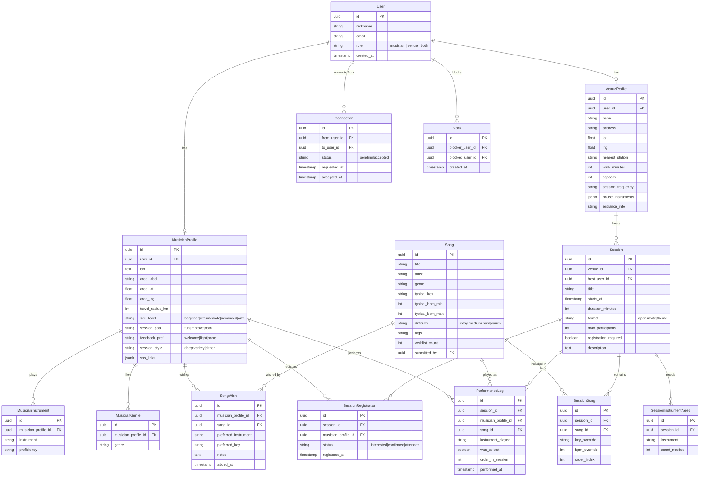

# NearJam — Technical Design Document

**Version**: 0.1 (2026-02-26)
**Status**: Draft

---

## 1. Architecture Overview

```
┌─────────────────────────────────────────────────────────────┐
│                        Browser / PWA                        │
│                  Next.js (App Router, SSR)                  │
└───────────────────────────┬─────────────────────────────────┘
                            │ HTTPS
┌───────────────────────────▼─────────────────────────────────┐
│              Azure Static Web Apps (Free Tier)              │
│         Next.js frontend + API Routes (Edge/Node)           │
└──────┬────────────────────┬────────────────────────────────-┘
       │                    │
       │ Auth (NextAuth.js) │ DB queries (Prisma ORM)
       │                    │
┌──────▼──────┐   ┌─────────▼───────────────────────────────┐
│  NextAuth   │   │  Azure Database for PostgreSQL           │
│  (JWT/DB    │   │  Flexible Server — Burstable B1ms        │
│   session)  │   │  (portable standard PostgreSQL)          │
└─────────────┘   └─────────────────────────────────────────-┘
                            │
                  ┌─────────▼──────────┐
                  │   Claude API       │
                  │  (AI suggestions)  │
                  └────────────────────┘
```

### Key Design Principles

1. **Portability first** — No Azure-specific services in the application layer. PostgreSQL, Next.js, and NextAuth.js run anywhere. Migration path: Vercel + Railway/Supabase.
2. **Scale to zero** — Azure Static Web Apps with API Routes has no idle cost.
3. **Standard PostgreSQL** — Avoid Cosmos DB, Azure SQL-specific features, or any proprietary extension. Use vanilla SQL / Prisma ORM.

---

## 2. Tech Stack

| Layer | Technology | Reason |
|-------|-----------|--------|
| Frontend | Next.js 15 (App Router) + TypeScript | SSR/SSG, API Routes, portable |
| Styling | Tailwind CSS | Utility-first, no runtime overhead |
| ORM | Prisma | Type-safe DB access, migration support, DB-agnostic |
| Auth | NextAuth.js v5 | Supports Google OAuth + email magic link; no vendor lock-in |
| Database | PostgreSQL 16 | Standard SQL, hosted on Azure DB for PostgreSQL Flexible |
| AI | Anthropic Claude API | Session combination suggestions, digest generation |
| Hosting | Azure Static Web Apps | Free tier for frontend; API Routes via Azure Functions runtime |
| CI/CD | GitHub Actions | Automatic deploy on push to `main` |
| Local dev | Docker Compose | PostgreSQL + app in containers |

---

## 3. Database Schema

### Entity Relationship Diagram



---

## 4. Key API Endpoints

All routes are Next.js API Routes under `/api/`.

### Auth
| Method | Path | Description |
|--------|------|-------------|
| POST | `/api/auth/[...nextauth]` | NextAuth.js handler |

### Musicians
| Method | Path | Description |
|--------|------|-------------|
| GET | `/api/musicians/me` | Get own musician profile |
| PUT | `/api/musicians/me` | Update own musician profile |
| GET | `/api/musicians/[id]` | Get public musician profile |
| GET | `/api/musicians/me/wishlist` | Get own song wishlist |
| POST | `/api/musicians/me/wishlist` | Add song to wishlist |
| DELETE | `/api/musicians/me/wishlist/[songId]` | Remove from wishlist |

### Venues
| Method | Path | Description |
|--------|------|-------------|
| GET | `/api/venues/[id]` | Get venue profile |
| PUT | `/api/venues/me` | Update own venue profile |
| GET | `/api/venues/me/sessions` | List own sessions |

### Sessions
| Method | Path | Description |
|--------|------|-------------|
| GET | `/api/sessions` | List sessions (with filter: area, genre, instrument, song) |
| POST | `/api/sessions` | Create a session (venue/host only) |
| GET | `/api/sessions/[id]` | Get session details |
| PUT | `/api/sessions/[id]` | Update session |
| POST | `/api/sessions/[id]/register` | Register interest/attendance |
| GET | `/api/sessions/[id]/attendees` | Get attendees (only if registered) |
| GET | `/api/sessions/[id]/log` | Get performance log |
| POST | `/api/sessions/[id]/log` | Add performance log entry (host only) |

### Songs
| Method | Path | Description |
|--------|------|-------------|
| GET | `/api/songs` | Search songs (title, artist, genre, tag) |
| POST | `/api/songs` | Submit new song (reviewed before publishing) |
| GET | `/api/songs/[id]` | Get song details |

### Matching
| Method | Path | Description |
|--------|------|-------------|
| GET | `/api/matching/sessions` | Sessions matching my wishlist + style + location |
| GET | `/api/matching/musicians` | Musicians matching a session's needs |

### Social
| Method | Path | Description |
|--------|------|-------------|
| POST | `/api/connections` | Send connection request |
| PUT | `/api/connections/[id]` | Accept/decline connection |
| POST | `/api/blocks` | Block a user |

### AI
| Method | Path | Description |
|--------|------|-------------|
| POST | `/api/ai/suggest-combinations` | Suggest new musician combos for a recurring session |
| POST | `/api/ai/session-digest` | Generate a post-session summary |

---

## 5. Matching Algorithm

Matching runs server-side on demand (not precomputed initially).

```typescript
// Pseudocode for session matching score
function scoreSessionForMusician(session: Session, musician: MusicianProfile): number {
  const songOverlap = intersect(session.songs, musician.wishlist).length / musician.wishlist.length
  const locationFit = distanceKm(musician.area, session.venue.location) <= musician.travel_radius_km ? 1 : 0
  const instrumentFit = session.instrumentNeeds.some(n => musician.instruments.includes(n.instrument)) ? 1 : 0
  const styleFit = computeStyleCompatibility(session.format, musician.preferences)

  return songOverlap * 0.4 + locationFit * 0.3 + instrumentFit * 0.2 + styleFit * 0.1
}
```

---

## 6. Security Design

### Authentication
- Google OAuth via NextAuth.js (primary)
- Email magic link as fallback (no password storage)
- JWT session tokens (stateless) with 30-day expiry

### Authorization
| Resource | Rule |
|----------|------|
| Musician profile (public fields) | Any authenticated user |
| Session attendee list | Only users registered for that session |
| Performance log | Only session host and registered attendees |
| Venue management | Only the venue's own user account |
| Block list | Private — only the blocker can see it |

### Privacy
- `area_lat` / `area_lng` stored in DB but **never returned in API** — only `area_label` (neighborhood string) is returned to clients
- Venue address returned for venue pages and sessions; never embedded in musician profiles
- Email address never returned via API

### Input Validation
- All API inputs validated with [Zod](https://zod.dev) schemas at the route boundary
- SQL injection: impossible via Prisma (parameterized queries)
- XSS: Next.js auto-escapes JSX; free-text fields sanitized with DOMPurify before storage

### Rate Limiting
- API routes rate-limited via `@upstash/ratelimit` (or simple in-memory limiter for MVP)
- Match and AI endpoints: stricter limits (10 req/min per user)

---

## 7. Local Development

```bash
# Start PostgreSQL + app
docker compose up

# Apply DB migrations
npx prisma migrate dev

# Seed sample data
npx prisma db seed

# Run dev server
npm run dev
```

`docker-compose.yml`:
```yaml
services:
  db:
    image: postgres:16
    environment:
      POSTGRES_DB: nearjam
      POSTGRES_USER: nearjam
      POSTGRES_PASSWORD: dev_password
    ports:
      - "5432:5432"
  app:
    build: .
    depends_on: [db]
    environment:
      DATABASE_URL: postgresql://nearjam:dev_password@db:5432/nearjam
    ports:
      - "3000:3000"
```

---

## 8. Deployment (Azure)

```
GitHub main branch
      │
      ▼ GitHub Actions
Azure Static Web Apps
  ├── Next.js static pages (CDN)
  ├── API Routes → Azure Functions (Node.js runtime)
  └── Managed identity → Azure DB for PostgreSQL
```

### Environment Variables (secrets in GitHub / Azure App Settings)

```env
DATABASE_URL=postgresql://...
NEXTAUTH_SECRET=...
NEXTAUTH_URL=https://nearjam.app
GOOGLE_CLIENT_ID=...
GOOGLE_CLIENT_SECRET=...
ANTHROPIC_API_KEY=...
```

### Azure Resources

| Resource | SKU | Est. Monthly Cost |
|----------|-----|------------------|
| Azure Static Web Apps | Free | ¥0 |
| Azure DB for PostgreSQL Flexible | Burstable B1ms (1 vCore, 2GB) | ~¥2,500 |
| **Total** | | **~¥2,500/month** |

> Claude API usage is pay-per-use; expected minimal at MVP scale.

---

## 9. Migration Path (If MVP Ends)

If Microsoft MVP benefits are discontinued:

| Component | Current | Migration target |
|-----------|---------|-----------------|
| Frontend | Azure Static Web Apps | Vercel (free tier, same Next.js) |
| Database | Azure DB for PostgreSQL | Railway / Supabase / Render (all standard PostgreSQL) |
| CI/CD | GitHub Actions | No change needed |

**Estimated migration effort: < 1 day.** All infrastructure is portable by design.

---

## 10. Open Technical Questions

- [ ] Should we use Server Actions (Next.js) or traditional REST API routes?
- [ ] Full-text search for songs: PostgreSQL `tsvector` or an external search index?
- [ ] Push notifications: Web Push API (PWA) or email only at MVP?
- [ ] Session real-time updates (performance log): polling vs. WebSockets vs. Server-Sent Events?
- [ ] AI suggestions: synchronous API call or async job queue?
