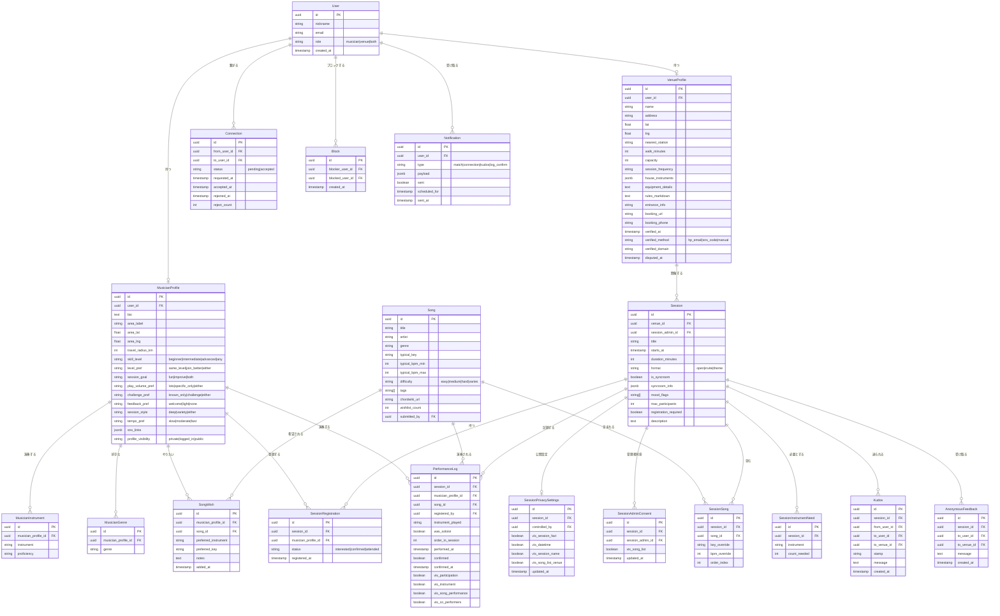

# NearJam — 技術設計書

**バージョン**: 0.2（2026-02-26）
**ステータス**: ドラフト
**対応PRD**: v0.2

---

## 1. アーキテクチャ概要

```
┌─────────────────────────────────────────────────────────────┐
│                    ブラウザ / PWA                            │
│               Next.js（App Router, SSR）                     │
└───────────────────────────┬─────────────────────────────────┘
                            │ HTTPS
┌───────────────────────────▼─────────────────────────────────┐
│          Azure Static Web Apps（無料プラン）                  │
│       Next.js フロントエンド + API Routes（Edge/Node）         │
└──────┬────────────────────┬────────────────────────────────-┘
       │                    │
       │ 認証（NextAuth.js） │ DB クエリ（Prisma ORM）
       │                    │
┌──────▼──────┐   ┌─────────▼───────────────────────────────┐
│  NextAuth   │   │  Azure Database for PostgreSQL            │
│  (JWT/DB    │   │  Flexible Server — Burstable B1ms         │
│   セッション) │   │  （標準 PostgreSQL — どこでも移行可能）     │
└─────────────┘   └─────────────────────────────────────────-┘
                            │
                  ┌─────────▼──────────┐
                  │   Claude API       │
                  │  （AI 提案機能）    │
                  └────────────────────┘
```

### 設計原則

1. **可搬性最優先** — アプリケーション層に Azure 固有のサービスを使わない。PostgreSQL・Next.js・NextAuth.js はどこでも動く。移行先の候補: Vercel + Railway / Supabase。
2. **スケールゼロ** — Azure Static Web Apps + API Routes はアイドル時のコストがかからない。
3. **標準 PostgreSQL** — Cosmos DB・Azure SQL 固有機能・独自拡張は使わない。Prisma ORM 経由で標準 SQL のみ使用。

---

## 2. 技術スタック

| レイヤー | 技術 | 選定理由 |
|---------|------|---------|
| フロントエンド | Next.js 15（App Router）+ TypeScript | SSR/SSG・API Routes・可搬性 |
| スタイリング | Tailwind CSS | ユーティリティファースト・実行時オーバーヘッドなし |
| ORM | Prisma | 型安全な DB アクセス・マイグレーション管理・DB 非依存 |
| 認証 | NextAuth.js v5 | Google OAuth + メールマジックリンク対応・ベンダーロックインなし |
| データベース | PostgreSQL 16 | 標準 SQL・Azure DB for PostgreSQL Flexible でホスティング |
| AI | Anthropic Claude API | セッション組み合わせ提案・ダイジェスト生成 |
| ホスティング | Azure Static Web Apps | フロントエンド無料・API Routes は Azure Functions ランタイム |
| CI/CD | GitHub Actions | `main` ブランチへのプッシュで自動デプロイ |
| ローカル開発 | Docker Compose | PostgreSQL + アプリをコンテナで統合 |

---

## 3. データベーススキーマ

### 3.1 設計上の重要方針

**AND-consentモデルの実装方針**:
演奏ログの可視性は複数の主体が個別に制御する。「全員が同意した情報だけ公開」というAND結合ルールを、各主体のbooleanカラムで表現する。

```
# 「AさんがXXXを演奏した」が見えるかどうか
vis_musician = true
AND vis_venue = true
AND vis_session_admin = true
→ 公開

# いずれか1つでもfalseなら非公開。即時反映。
```

**会場認証の状態管理**:
`verified_at` / `disputed_at` のNULL可timestampで状態を表現する。

| 状態 | 条件 |
|------|------|
| 未確認 | `verified_at IS NULL` |
| 確認済み | `verified_at IS NOT NULL AND disputed_at IS NULL` |
| 異議申し立て中 | `disputed_at IS NOT NULL` |

---

### 3.2 ER図



---

### 3.3 主要テーブルの補足説明

#### `Session.session_admin_id`

PRD v0.2でホスト役職を廃止。セッション作成者が自動的に管理者になるが、他の参加者に委譲可能。管理権限（参加者強制退出・セッション完了宣言・管理者委譲）はセッション管理者のみ。当日ツール（曲キュー・演奏ログ）は全参加者が使える。

#### `Session.mood_flags`

PostgreSQL の `text[]` 型で格納。有効値:

| 値 | 表示ラベル |
|----|---------|
| `fun_allowed` | 🎉 失敗大歓迎 |
| `beginner_welcome` | 🌱 初心者歓迎 |
| `advanced` | 🔥 上級者向け |
| `practice_focus` | 📚 練習重視 |
| `theme_night` | 🎭 テーマナイト |
| `quiet_listening` | 🤫 静聴系 |
| `lively` | 🥳 ワイワイ系 |
| `social` | 🤝 交流重視 |

#### `SessionPrivacySettings`

会場オーナーが制御するセッション単位の公開設定。1セッションに1レコード。

| カラム | 制御対象 |
|--------|---------|
| `vis_session_fact` | セッションの存在自体を公開するか |
| `vis_datetime` | 開催日時・時間帯を公開するか（⚠️ JASRAC警告対象） |
| `vis_session_name` | セッション名を公開するか |
| `vis_song_list_venue` | 曲リストを公開するか（会場側の同意。ホスト側は `SessionAdminConsent` で管理） |

#### `PerformanceLog` のAND-consent実装

`vis_*` カラムはミュージシャン本人が制御する自分のプライバシー設定。実際に情報が表示されるかは以下のAND結合で決まる:

```
# 「AさんがXXXセッションでギターを弾いた」が見えるか
PerformanceLog.vis_participation = true       -- Aさんが参加公開 ON
AND SessionPrivacySettings.vis_session_fact = true  -- 会場が公開 ON

# 「Aさんが〇〇という曲を弾いた」が見えるか（曲名込み）
PerformanceLog.vis_song_performance = true    -- Aさんが同意
AND SessionPrivacySettings.vis_song_list_venue = true  -- 会場が同意
AND SessionAdminConsent.vis_song_list = true  -- セッション管理者が同意

# 会場名の表示（会場が未同意でもAさん自身の参加履歴は残せる）
# → 会場名の部分だけ「非公開の会場」に差し替え
```

#### `Notification` テーブル

マッチング通知はリアルタイム配信しない。`scheduled_for` に翌朝のダイジェスト時刻をセットしてバッチ送信。**ウィッシュリスト推測攻撃（セッション作成→即通知→ウィッシュリスト保有者特定）を時間的に崩すための設計。**

---

## 4. 主要 API エンドポイント

すべてのルートは `/api/` 配下の Next.js API Routes として実装します。

### 認証
| メソッド | パス | 説明 |
|--------|------|------|
| POST | `/api/auth/[...nextauth]` | NextAuth.js ハンドラ |

### ミュージシャン
| メソッド | パス | 説明 |
|--------|------|------|
| GET | `/api/musicians/me` | 自分のミュージシャンプロフィール取得 |
| PUT | `/api/musicians/me` | 自分のミュージシャンプロフィール更新（10軸すべて） |
| GET | `/api/musicians/[id]` | 公開ミュージシャンプロフィール取得 |
| GET | `/api/musicians/me/wishlist` | 自分のウィッシュリスト取得 |
| POST | `/api/musicians/me/wishlist` | ウィッシュリストに曲を追加 |
| DELETE | `/api/musicians/me/wishlist/[songId]` | ウィッシュリストから曲を削除 |

### 会場
| メソッド | パス | 説明 |
|--------|------|------|
| GET | `/api/venues/[id]` | 会場プロフィール取得（未認証の場合は⚠️バッジ情報を含む） |
| PUT | `/api/venues/me` | 自分の会場プロフィール更新 |
| PUT | `/api/venues/me/rules` | ルール・マナーページ更新（確認済み会場のみ） |
| GET | `/api/venues/me/sessions` | 自分の会場のセッション一覧 |
| POST | `/api/venues/me/verification/start` | 会場認証開始（HPスクレイピング → メール候補返却） |
| POST | `/api/venues/me/verification/confirm` | 確認コード入力 → 確認済みに昇格 |
| POST | `/api/venues/me/verification/sns-start` | SNS確認コード生成・表示指示 |
| POST | `/api/venues/me/verification/sns-check` | SNSページをチェックしてコード確認 |
| POST | `/api/venues/[id]/dispute` | なりすまし異議申し立て |

### セッション
| メソッド | パス | 説明 |
|--------|------|------|
| GET | `/api/sessions` | セッション一覧（エリア・ジャンル・楽器・曲・ムードフラグでフィルタ） |
| POST | `/api/sessions` | セッション作成（会場または任意のミュージシャン） |
| GET | `/api/sessions/[id]` | セッション詳細取得 |
| PUT | `/api/sessions/[id]` | セッション更新（セッション管理者のみ） |
| POST | `/api/sessions/[id]/register` | 参加意思表明・参加登録 |
| GET | `/api/sessions/[id]/attendees` | 参加者一覧取得（登録者のみ閲覧可） |
| PUT | `/api/sessions/[id]/admin` | セッション管理者権限を他の参加者へ委譲（管理者のみ） |
| DELETE | `/api/sessions/[id]/attendees/[userId]` | 参加者強制退出（管理者のみ） |
| POST | `/api/sessions/[id]/complete` | セッション完了宣言・ログ公式確定（管理者のみ） |
| GET | `/api/sessions/[id]/queue` | 曲キュー取得（当日ツール — 参加者全員） |
| PUT | `/api/sessions/[id]/queue` | 曲キュー更新（参加者全員） |
| GET | `/api/sessions/[id]/log` | 演奏ログ取得（AND-consent適用済み） |
| POST | `/api/sessions/[id]/log` | 演奏ログ追加（**参加者全員**が自分または割り当て分を登録可） |
| PUT | `/api/sessions/[id]/log/[logId]` | 演奏ログ更新（自分のログのみ） |
| PUT | `/api/sessions/[id]/log/[logId]/confirm` | ホストが登録したログを対象者が確認・否定 |
| PUT | `/api/sessions/[id]/privacy` | セッション公開設定更新（会場オーナーのみ） |
| PUT | `/api/sessions/[id]/admin-consent` | セッション管理者の曲公開同意更新 |

### 曲
| メソッド | パス | 説明 |
|--------|------|------|
| GET | `/api/songs` | 曲検索（タイトル・アーティスト・ジャンル・タグ） |
| POST | `/api/songs` | 曲の新規投稿（審査後に公開） |
| GET | `/api/songs/[id]` | 曲詳細取得 |

### マッチング
| メソッド | パス | 説明 |
|--------|------|------|
| GET | `/api/matching/sessions` | ウィッシュリスト・スタイル・エリアに合うセッション一覧 |
| GET | `/api/matching/musicians` | セッションの募集条件に合うミュージシャン一覧 |

### ソーシャル
| メソッド | パス | 説明 |
|--------|------|------|
| POST | `/api/connections` | コネクション申請を送る |
| PUT | `/api/connections/[id]` | コネクション申請を承認・拒否 |
| POST | `/api/blocks` | ユーザーをブロック |

### いいね！・フィードバック
| メソッド | パス | 説明 |
|--------|------|------|
| POST | `/api/kudos` | いいね！を送る（セッション終了後・参加者のみ） |
| GET | `/api/kudos/received` | 自分が受け取ったいいね！一覧（本人のみ） |
| POST | `/api/feedback/anonymous` | 会場・ホストへの匿名フィードバック送信 |
| GET | `/api/feedback/anonymous/received` | 受け取った匿名フィードバック一覧（受信者のみ） |

### AI
| メソッド | パス | 説明 |
|--------|------|------|
| POST | `/api/ai/suggest-combinations` | 定期セッション向けの新しいミュージシャン組み合わせ提案 |
| POST | `/api/ai/session-digest` | セッション後のサマリー生成 |

---

## 5. マッチングアルゴリズム

マッチングはオンデマンドでサーバーサイドで計算します（初期段階では事前計算なし）。

```typescript
// ミュージシャンに対するセッションのマッチングスコア（疑似コード）
function scoreSessionForMusician(session: Session, musician: MusicianProfile): number {
  // ウィッシュリストとセッション曲の重なり
  const songOverlap = intersect(session.songs, musician.wishlist).length
    / Math.max(musician.wishlist.length, 1)

  // 移動可能距離内にあるか（SYNCROOMセッションは距離不問）
  const locationFit = session.is_syncroom
    ? 1.0
    : distanceKm(musician.area, session.venue.location) <= musician.travel_radius_km ? 1 : 0

  // 募集楽器を演奏できるか
  const instrumentFit = session.instrumentNeeds.some(
    n => musician.instruments.includes(n.instrument)
  ) ? 1 : 0

  // スタイル適合度（5軸の平均: レベル感・演奏量・チャレンジ姿勢・フィードバック・テンポ）
  const styleFit = computeStyleCompatibility(session, musician)

  // ムードフラグ適合度（例: 初心者が「上級者向け」に参加 → 警告）
  const moodFit = computeMoodFlagCompatibility(session.mood_flags, musician)

  if (session.is_syncroom) {
    // SYNCROOMセッション: エリア不問なので曲・スタイル重視
    return songOverlap * 0.5 + styleFit * 0.25 + moodFit * 0.15 + instrumentFit * 0.10
  } else {
    // 対面セッション
    return songOverlap * 0.4 + locationFit * 0.25 + styleFit * 0.2 + moodFit * 0.1 + instrumentFit * 0.05
  }
}

// ミスマッチ警告（スコアとは独立して表示）
function getMismatchWarnings(session: Session, musician: MusicianProfile): string[] {
  const warnings: string[] = []
  if (musician.play_volume_pref === 'lots' && session.max_participants > 8)
    warnings.push('参加者が多く、演奏機会が分散する可能性があります')
  if (musician.challenge_pref === 'known_only' && session.mood_flags.includes('fun_allowed'))
    warnings.push('即興・初見曲が多いセッションかもしれません')
  if (musician.skill_level === 'beginner' && session.mood_flags.includes('advanced'))
    warnings.push('上級者向けのセッションです')
  return warnings
}
```

---

## 6. セキュリティ設計

### 認証
- Google OAuth（NextAuth.js 経由、主要方法）
- メールマジックリンク（パスワード不要、フォールバック）
- JWT セッショントークン（ステートレス）、有効期限 30 日

### 認可ルール

| リソース | ルール |
|---------|--------|
| ミュージシャンプロフィール（公開フィールド） | ログイン済みユーザーなら誰でも |
| セッション参加者一覧 | 当該セッションに登録したユーザーのみ |
| 演奏ログ（AND-consent適用後） | ログイン済みユーザー（会場が設定した公開範囲に従う） |
| 演奏ログ（未ログイン） | 表示しない（`noindex` + 認証ガード） |
| 会場管理・公開設定 | 会場の所有者アカウントのみ |
| 曲リストを含む統計 | API からの一括取得を禁止（スクレイピング対策） |
| いいね！受信ボックス | 受け取った本人のみ |
| 匿名フィードバック受信 | 会場オーナー / ホストのみ |
| ブロックリスト | 非公開 — ブロックした本人のみ確認可能 |
| セッション管理操作 | セッション管理者のみ（当日ツールの読み書きは全参加者） |

### プライバシー

- `area_lat` / `area_lng` は DB に保存するが、**API からは絶対に返さない** — クライアントには `area_label`（地区名の文字列）のみを返す
- 会場の住所は会場ページとセッション詳細ページにのみ表示；ミュージシャンプロフィールには埋め込まない
- メールアドレスは API から絶対に返さない
- **演奏ログは未ログインユーザーに表示しない（`noindex` + 認証ガード）** — 検索エンジンに曲名が渡らないようにする
- 会場の曲統計・演奏ログはページネーションなし一括取得 API を提供しない（スクレイピング防止）

### JASRAC リスク対応（§3.5 準拠）

- 日時公開 ON 時に警告UI表示（操作はブロックしない）
- 曲リスト公開 ON 時に警告UI表示
- 曲名を含む情報は認証済みユーザーにのみ返す

### 接続申請クールダウン（§5.2 準拠）

```
拒否された場合: Connection.rejected_at を記録
  → 同じ相手への再申請は rejected_at から 30 日間ブロック

Connection.reject_count >= 3:
  → 自動的に Block レコードを作成（ソフトブロック）
  → 「申請を受け取らない」設定と同等の状態になる
```

### マッチング通知のバッチ配信（プライバシー対策）

マッチング通知はリアルタイム送信しない。`Notification` テーブルに `scheduled_for = 翌朝7:00` で登録し、バッチジョブが1日1回送信する。

**理由**: セッション作成 → 即座に通知が届く設計にすると、「セッション A を作成した直後に通知が届いた人 B は、A の曲をウィッシュリストに持っている」という時間相関攻撃が成立する。バッチ化することでウィッシュリスト保有者の特定を困難にする。

### 入力バリデーション
- すべての API 入力をルート境界で [Zod](https://zod.dev) スキーマによりバリデーション
- SQL インジェクション: Prisma（パラメータ化クエリ）により防止
- XSS: Next.js が JSX を自動エスケープ；フリーテキスト入力は保存前に DOMPurify でサニタイズ
- `rules_markdown` フィールドはサーバーサイドで許可タグのみに制限（危険な HTML を除去）

### レート制限
- API ルートは `@upstash/ratelimit`（または MVP 向けのシンプルなインメモリリミッター）でレート制限
- マッチング・AI エンドポイントはより厳しい制限（ユーザーごとに 10 リクエスト/分）
- 会場認証エンドポイント（HPスクレイピング）は 1 アカウントにつき 5 回/日

---

## 7. ローカル開発環境

```bash
# PostgreSQL + アプリを起動
docker compose up

# DB マイグレーション適用
npx prisma migrate dev

# サンプルデータのシード
npx prisma db seed

# 開発サーバー起動
npm run dev
```

`docker-compose.yml`:
```yaml
services:
  db:
    image: postgres:16
    environment:
      POSTGRES_DB: nearjam
      POSTGRES_USER: nearjam
      POSTGRES_PASSWORD: dev_password
    ports:
      - "5432:5432"
  app:
    build: .
    depends_on: [db]
    environment:
      DATABASE_URL: postgresql://nearjam:dev_password@db:5432/nearjam
    ports:
      - "3000:3000"
```

---

## 8. Azure へのデプロイ

```
GitHub main ブランチ
      │
      ▼ GitHub Actions
Azure Static Web Apps
  ├── Next.js 静的ページ（CDN 配信）
  ├── API Routes → Azure Functions（Node.js ランタイム）
  └── マネージド ID → Azure DB for PostgreSQL
```

### 環境変数（GitHub Secrets / Azure App Settings に登録）

```env
DATABASE_URL=postgresql://...
NEXTAUTH_SECRET=...
NEXTAUTH_URL=https://nearjam.app
GOOGLE_CLIENT_ID=...
GOOGLE_CLIENT_SECRET=...
ANTHROPIC_API_KEY=...
```

### Azure リソース構成

| リソース | SKU | 月額推定コスト |
|---------|-----|-------------|
| Azure Static Web Apps | 無料プラン | ¥0 |
| Azure DB for PostgreSQL Flexible | Burstable B1ms（1 vCore, 2GB） | 約 ¥2,500 |
| **合計** | | **約 ¥2,500/月** |

> Claude API の利用費は従量課金。MVP 規模では最小限の見込み。

---

## 9. 移行手順（MVP 特典終了時）

Microsoft MVP 特典が終了した場合の移行先:

| コンポーネント | 現状 | 移行先候補 |
|-------------|------|----------|
| フロントエンド | Azure Static Web Apps | Vercel（無料枠あり・同じ Next.js） |
| データベース | Azure DB for PostgreSQL | Railway / Supabase / Render（すべて標準 PostgreSQL） |
| CI/CD | GitHub Actions | 変更不要 |

**移行工数の見積もり: 1日未満。** 全インフラは可搬性を前提に設計されています。

---

## 10. 技術的な未決定事項

- [ ] Next.js の Server Actions を使うか、従来の REST API ルートにするか
- [ ] 曲の全文検索: PostgreSQL の `tsvector` か、外部検索インデックスか
- [ ] プッシュ通知: Web Push API（PWA）か、MVP はメールのみか
- [ ] セッションのリアルタイム更新（曲キュー・演奏ログ）: ポーリング vs WebSocket vs Server-Sent Events
- [ ] AI 提案: 同期的な API 呼び出しか、非同期ジョブキューか
- [ ] 会場認証のSNSチェック: cron（Azure Functions Timer Trigger）で定期チェックか、会場が手動で「確認しました」ボタンを押すか
